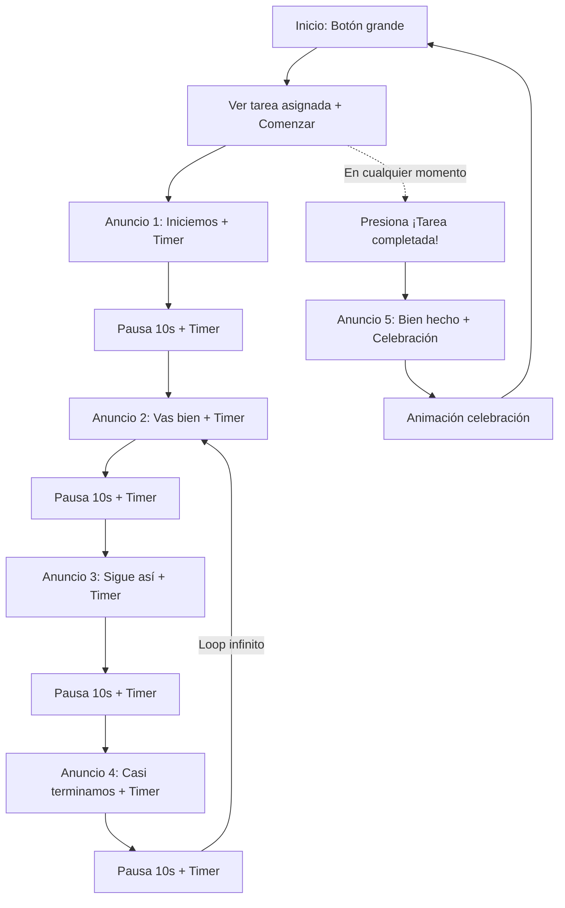
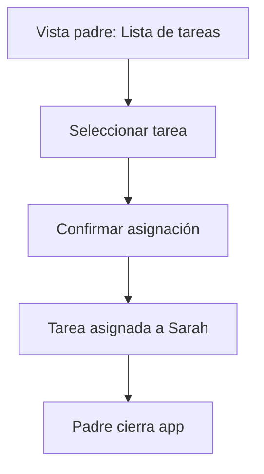

---
stepsCompleted:
  - step-01-init
  - step-02-discovery
  - step-03-core-experience
  - step-04-emotional-response
  - step-05-inspiration
  - step-06-design-system
  - step-07-defining-experience
  - step-08-visual-foundation
  - step-09-design-directions
  - step-10-user-journeys
  - step-11-component-strategy
  - step-12-ux-patterns
  - step-13-responsive-accessibility
  - step-14-complete
inputDocuments:
  - source: PRD
    path: /home/gustavo/Documentos/Proyectos/sarah_app/_bmad-output/planning/prd.md
workflowType: 'ux-design'
---

# UX Design Specification sarah_app

**Author:** Gustavo
**Date:** 2026-05-26

---

<!-- UX design content will be appended sequentially through collaborative workflow steps -->

## Executive Summary

### Project Vision

App móvil que guía a niños por voz a completar tareas del hogar, fomentando la autonomía infantil y reduciendo la fricción padre-hijo.

### Target Users

- **Niño (Sarah):** Interactúa solo por voz. No requiere leer ni tocar la pantalla. Necesita estructura y guía auditiva.
- **Padre/Madre:** Gestiona tareas desde la app. Busca reducir la supervisión constante.

### Key Design Challenges

1. Pantalla ultra simple que un niño pueda usar sin leer
2. Indicar visualmente los estados (escuchando, timeout, reproduciendo)
3. Separar la vista del niño (mínima) de la del padre (gestión de tareas)

### Design Opportunities

- Interacción 100% por voz como diferenciador
- Experiencia lúdica y motivacional a través de audio
- UI mínima que no distrae al niño

## Core User Experience

### Defining Experience

- **Niño:** Presiona Iniciar → Ve su tarea asignada → Presiona ¡Comenzar! → Escucha guía motivacional + cronómetro → Presiona ¡Tarea completada!
- **Padre:** Abre app → Gestiona tareas → Asigna tarea

### Platform Strategy

- **Framework:** Flutter, Android (MVP)
- **Offline:** 100% sin conexión
- **Input principal:** Táctil (botones grandes)
- **Output principal:** Audio (parlante)
- **Interacción táctil:** Botón de inicio, botón comenzar, botón completar

### Effortless Interactions

- El niño solo presiona botones grandes — cero navegación
- La app guía todo el proceso por audio
- El padre asigna tareas en 2 taps

### Critical Success Moments

- Los anuncios mantienen al niño motivado durante la tarea
- El cronómetro visible ayuda al niño a medir su progreso
- El padre confirma que la tarea se completó sin intervención

### Experience Principles

1. **Mínima interacción visual** — el niño no necesita leer ni navegar
2. **Audio como guía principal** — la motivación es auditiva
3. **Control táctil simple** — botones grandes de una acción
4. **Padre en control** — gestión simple y rápida de tareas

## Desired Emotional Response

### Primary Emotional Goals

- **Niño:** Orgullosa al completar la tarea. Motivada durante el proceso.
- **Padre:** Tranquilo y aliviado al saber que la tarea se realiza sin supervisión.

### Emotional Journey Mapping

- **Antes de usar:** Niño curioso, padre con esperanza.
- **Durante la tarea:** Niño enfocado y guiado. Padre despreocupado.
- **Al completar:** Niño orgullosa del logro. Padre aliviado.
- **Al regresar:** Niño confiada en que la app la guiará.

### Micro-Emotions

- **Fomentar:** Orgullo, motivación, confianza, alivio, seguridad.
- **Evitar:** Frustración (si no reconoce la voz), presión (por tiempo o complejidad).

### Design Implications

- **Orgullo →** Audio entusiasta y feedback visual positivo al completar
- **Tranquilidad →** Interfaz simple que muestra estado de la tarea
- **Evitar frustración →** Botón "¡Tarea completada!" siempre visible, el niño controla cuándo finalizar
- **Evitar presión →** Sin temporizadores agresivos, cronómetro informativo (no restrictivo)

## Design System Foundation

### Design System Choice

Material Design (Flutter nativo)

### Rationale for Selection

- Integrado en Flutter, zero setup
- Customizable vía ThemeData para interfaz infantil
- Buenos defaults de accesibilidad
- Ideal para MVP de 2 semanas

### Customization Strategy

- Colores llamativos y contrastantes para niños
- Formas redondeadas y botones grandes
- Tipografía clara y de gran tamaño
- Estados visuales para cada fase (inicio/escuchando/reproduciendo/completado)

## Core User Experience

### Defining Experience

"Presiona el botón grande, mira tu tarea, presiona comenzar, escucha y completa"

### User Mental Model

El niño piensa: "Presiono el botón, veo qué tengo que hacer, presiono comenzar, escucho los mensajes y cuando termino presiono el botón verde".

### Experience Mechanics

1. **Inicio:** Botón grande y llamativo. El niño presiona.
2. **Tarea asignada:** La app muestra el nombre de la tarea activa + botón "¡Comenzar!".
3. **Guía + Cronómetro:** Al presionar "Comenzar", se reproduce `task_started` una vez. Durante la ejecución de la tarea, los 3 audios intermedios (`good_job`, `keep_going`, `almost_done`) se reproducen en bucle continuo con pausas de 10s entre cada uno. Un cronómetro cuenta el tiempo transcurrido.
4. **Completado:** El niño presiona "¡Tarea completada!" cuando termina. La app detiene el bucle de audios intermedios, reproduce `all_done`, marca la tarea, muestra animación de celebración y regresa al inicio.

### Novel UX Patterns

Flujo de 3 estados con audio en bucle. Tres estados: idle (tarea → comenzar), playing (task_started + bucle infinito good_job/keep_going/almost_done con pausas de 10s + timer + botón completar), completed (all_done + celebración).

## Visual Design Foundation

### Color System

- **Primario:** Naranja/ámbar (#FF8C00) — energía, diversión, calidez
- **Secundario:** Azul claro (#42A5F5) — confianza, calma
- **Fondo:** Blanco (#FFFFFF) con tarjetas de color suave
- **Acento:** Verde brillante (#66BB6A) — éxito, logro, completado
- **Textos:** Gris oscuro (#212121) para contraste alto

### Typography System

- **Familia:** Sans-serif (Roboto o similar, legible en pantalla)
- **Botones niños:** 28-32px, bold
- **Títulos:** 24px
- **Texto padre:** 14-16px
- **Mensajes de audio:** No aplica (son reproducción de voz)

### Spacing & Layout Foundation

- **Botones:** Mínimo 64px de altura, esquinas redondeadas (16px radio)
- **Espaciado:** Base 16px, amplio y aireado para niños
- **Layout:** Centrado vertical y horizontalmente, una sola acción por pantalla

### Accessibility Considerations

- Contraste alto en todos los elementos
- Botones grandes para dedos pequeños
- Uso de iconos + texto (para padres que gestionan tareas)
- Feedback visual + auditivo siempre

## Design Direction Decision

### Screens Defined

1. **Inicio (niño):** Fondo color sólido, botón grande y pulsante "Presiona para comenzar"
2. **Tarea (niño):** Muestra nombre de tarea asignada + botón "¡Comenzar!" → durante la tarea: cronómetro + botón "¡Tarea completada!"
3. **Tarea completada:** Check verde, "¡Muy bien!", celebración visual + audio
4. **Gestión de tareas (padres):** Lista simple con asignación y estado

### Chosen Direction

Minimalista, lúdico, una acción por pantalla. El niño nunca navega — solo presiona, escucha y completa.

## User Journey Flows

### Flujo 1: Sarah completa una tarea

### Flujo 2: Padre asigna tarea

### Flow Optimization Principles

- Una sola acción por pantalla (niño)
- Timeout siempre regresa al inicio sin penalización
- Feedback visual + auditivo combinado en cada paso

## Component Strategy

### Design System Components

- ElevatedButton (botón inicio, confirmar)
- Icons (micrófono, play, check)
- ListView (tareas del padre)
- LinearProgressIndicator (barra de 10s)
- AlertDialog (confirmaciones del padre)

### Custom Components

- **Botón de inicio animado:** Naranja, grande (80dp), pulsación suave, icono de play
- **Indicador de escucha:** Ondas de sonido animadas + barra de progreso regresiva
- **Pantalla de celebración:** Check verde + animación de logro + texto "¡Completada!"

### Implementation Roadmap

**MVP:** Botón inicio, indicador escucha, barra progreso, lista de tareas
**Post-MVP:** Animaciones más elaboradas, confeti, efectos de sonido

## UX Consistency Patterns

### Button Hierarchy

- **Niño:** 1 botón por pantalla, grande y centrado (80dp)
- **Padre:** Botones de texto/icono estándar Material Design

### Feedback Patterns

- **Tarea lista:** Muestra el nombre de la tarea activa + botón "¡Comenzar!"
- **En progreso:** Cronómetro en tiempo real + audio motivacional de fondo
- **Completado:** Check animado + texto "¡Muy bien!" + audio de celebración

### Navigation Patterns

- **Flujo niño:** 3 pantallas lineales (Inicio → Tarea → Completado → Inicio)
- **Vista padre:** Pantalla separada con lista de tareas
- **Cambio modo niño↔padre:** Navegación automática via BlocListener con pushNamedAndRemoveUntil
- Sin navegación por tabs, sin menú lateral

## Responsive Design & Accessibility

### Responsive Strategy

- **Target:** Android phones (360px - 480px ancho)
- **Layout:** Centrado vertical/horizontal, escala proporcional
- **Orientación:** Portrait inicialmente

### Accessibility Strategy

- **WCAG Level A** (Mínimo para MVP)
- Contraste de color > 4.5:1 para texto
- Botones mínimos de 48x48dp (usamos 64-80dp)
- Feedback visual + auditivo siempre presente
- Sin dependencia de solo color para información crítica

### Implementation Guidelines

- Usar `MediaQuery` para escalar según densidad de pantalla
- Texto en sp, dimensiones en dp (Flutter estándar)
- `Semantics` widget para lectores de pantalla (post-MVP)
- Probar en 2-3 tamaños de pantalla diferentes
