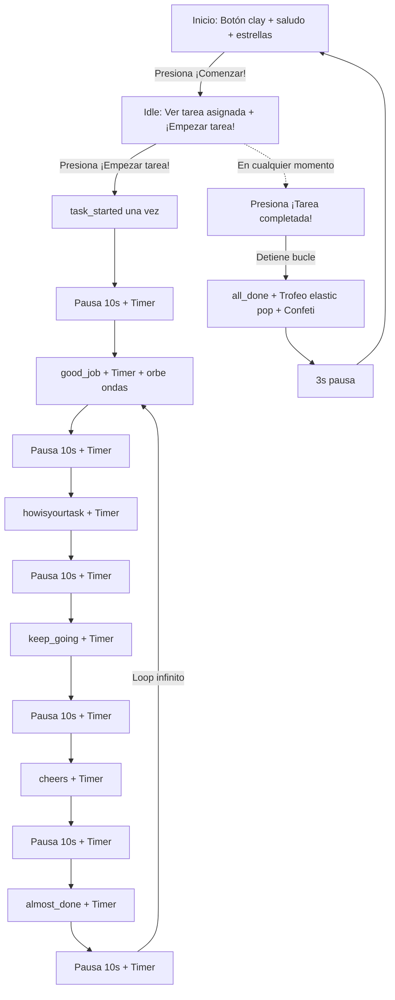
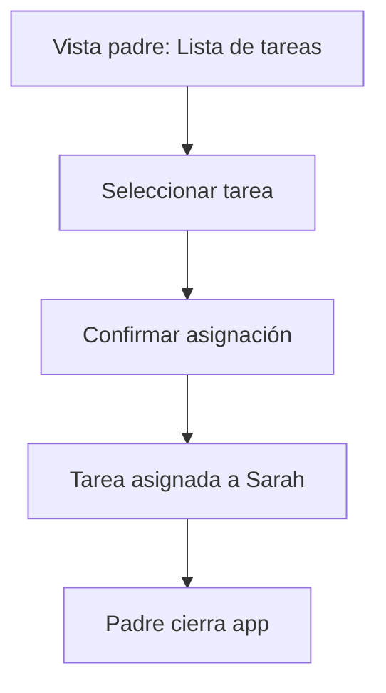

---
stepsCompleted:
  - step-01-init
  - step-02-discovery
  - step-03-core-experience
  - step-04-emotional-response
  - step-05-inspiration
  - step-06-design-system
  - step-07-defining-experience
  - step-08-visual-foundation
  - step-09-design-directions
  - step-10-user-journeys
  - step-11-component-strategy
  - step-12-ux-patterns
  - step-13-responsive-accessibility
  - step-14-complete
inputDocuments:
  - source: PRD
    path: /home/gustavo/Documentos/Proyectos/sarah_app/_bmad-output/planning/prd.md
workflowType: 'ux-design'
---

# UX Design Specification sarah_app

**Author:** Gustavo
**Date:** 2026-05-30

---

<!-- UX design content will be appended sequentially through collaborative workflow steps -->

## Executive Summary

### Project Vision

App móvil que guía a niños por voz a completar tareas del hogar, fomentando la autonomía infantil y reduciendo la fricción padre-hijo.

### Target Users

- **Niño (Sarah):** Interactúa solo con botones grandes. No requiere leer. Necesita estructura y guía auditiva.
- **Padre/Madre:** Gestiona tareas desde la app. Busca reducir la supervisión constante.

### Key Design Challenges

1. Pantalla ultra simple que un niño pueda usar sin leer
2. Indicar visualmente los estados (idle, reproduciendo, completado)
3. Separar la vista del niño (mínima) de la del padre (gestión de tareas)

### Design Opportunities

- Experiencia lúdica y motivacional a través de audio
- Estilo Claymorphism como diferenciador visual
- UI mínima que no distrae al niño

## Core User Experience

### Defining Experience

- **Niño:** Presiona ¡Comenzar! → Ve su tarea asignada → Presiona ¡Empezar tarea! → Escucha guía motivacional en bucle + cronómetro → Presiona ¡Tarea completada!
- **Padre:** Abre app → Gestiona tareas → Asigna tarea

### Platform Strategy

- **Framework:** Flutter, Android (MVP)
- **Offline:** 100% sin conexión
- **Input principal:** Táctil (botones grandes, clay-style)
- **Output principal:** Audio (parlante, bucle motivacional)
- **Interacción táctil:** Botón ¡Comenzar!, botón ¡Empezar tarea!, botón ¡Tarea completada!

### Effortless Interactions

- El niño solo presiona botones grandes estilo clay — cero navegación
- La app guía todo el proceso por audio en bucle
- El padre asigna tareas en 2 taps

### Critical Success Moments

- El bucle de audios motivacionales mantiene al niño enfocado durante la tarea
- El cronómetro visible ayuda al niño a medir su progreso
- La animación de celebración (trofeo + confeti) refuerza el logro
- El padre confirma que la tarea se completó sin intervención

### Experience Principles

1. **Mínima interacción visual** — el niño no necesita leer ni navegar
2. **Audio como guía principal** — motivación auditiva en bucle
3. **Control táctil simple** — botones grandes clay (190dp) de una acción
4. **Claymorphism como identidad** — bordes gruesos, sombras dobles, esquinas 20-24px
5. **Celebración visual** — animación de logro al completar la tarea

## Desired Emotional Response

### Primary Emotional Goals

- **Niño:** Orgullosa al completar la tarea. Motivada durante el proceso.
- **Padre:** Tranquilo y aliviado al saber que la tarea se realiza sin supervisión.

### Emotional Journey Mapping

- **Antes de usar:** Niño curioso, padre con esperanza.
- **Durante la tarea:** Niño enfocado y guiado. Padre despreocupado.
- **Al completar:** Niño orgullosa del logro. Padre aliviado.
- **Al regresar:** Niño confiada en que la app la guiará.

### Micro-Emotions

- **Fomentar:** Orgullo, motivación, confianza, alivio, seguridad.
- **Evitar:** Frustración (si no reconoce la voz), presión (por tiempo o complejidad).

### Design Implications

- **Orgullo →** Animación de trofeo con elastic pop + confeti + audio `all_done` al completar
- **Tranquilidad →** Interfaz clay simple que muestra estado de la tarea con cronómetro
- **Evitar frustración →** Botón "¡Tarea completada!" siempre visible y pulsante, el niño controla cuándo finalizar
- **Evitar presión →** Sin temporizadores agresivos, cronómetro informativo (no restrictivo)

## Design System Foundation

### Design System Choice

Claymorphism sobre Material Design (Flutter nativo)

### Rationale for Selection

- Integrado en Flutter, customizable vía ThemeData
- Estilo lúdico y amigable para niños
- Buenos defaults de accesibilidad
- Diferenciador visual frente a apps infantiles estándar

### Customization Strategy

- **Claymorphism:** Bordes gruesos (3-4px), sombras dobles (outer drop + ambient), esquinas redondeadas 20-24px, efecto de presión al tocar
- **Paleta unisex morada:** Púrpura vivo (#8B5CF6), lavanda (#818CF8), dorado (#FBBF24), rosa arcilla (#F472B6)
- Botones grandes y pulsantes con glow ring
- Tipografía clara y de gran tamaño
- Estados visuales para cada fase (inicio/idle/reproduciendo/completado)

## Core User Experience

### Defining Experience

"Presiona ¡Comenzar!, mira tu tarea, presiona ¡Empezar tarea!, escucha los audios en bucle, completa y celebra"

### User Mental Model

El niño piensa: "Presiono el botón morado grande, veo qué tengo que hacer, presiono ¡Empezar tarea!, escucho los mensajes que se repiten y cuando termino presiono ¡Tarea completada! y veo el trofeo".

### Experience Mechanics

1. **Inicio:** Pantalla con saludo "¡Hola Sarah!" + estrellas flotantes + botón clay circular grande (190dp) con icono play y texto "¡Comenzar!". El niño presiona.
2. **Tarea asignada (idle):** La app muestra el nombre de la tarea activa en una clay card + botón "¡Empezar tarea!" púrpura.
3. **Guía + Cronómetro (playing):** Al presionar "Empezar tarea", se reproduce `task_started` una sola vez. Durante la ejecución, los 5 audios intermedios (`good_job`, `howisyourtask`, `keep_going`, `cheers`, `almost_done`) se reproducen en bucle continuo con pausas de 10s entre cada uno. Un cronómetro cuenta el tiempo transcurrido. Un orbe animado con ondas de sonido indica que la app está activa. Mensajes motivacionales rotan cada 5s ("¡Tú puedes!", "¡Vas genial!", etc.).
4. **Completado:** El niño presiona "¡Tarea completada!" (botón verde bouncing). La app detiene el bucle, reproduce `all_done`, marca la tarea, muestra animación de trofeo con confeti + texto "¡Lo lograste!" y regresa al inicio tras 3s.

### Novel UX Patterns

Flujo de 3 estados con audio en bucle. Tres estados: idle (tarea → empezar), playing (task_started + bucle infinito good_job/howisyourtask/keep_going/cheers/almost_done con pausas de 10s + timer + orbe de ondas + botón completar bouncing), completed (all_done + trofeo con elastic pop + confeti particle system).

## Visual Design Foundation

### Color System

- **Primario:** Púrpura vivo (#8B5CF6) — energía, logro, unisex
- **Primario oscuro:** Púrpura profundo (#7C3AED) — sombras, borde de botones
- **Secundario:** Lavanda/índigo suave (#818CF8) — calma, confianza
- **Acento:** Dorado soleado (#FBBF24) — alegría, highlights
- **Rosa arcilla:** Rosa cálido (#F472B6) — amigabilidad, calidez
- **Fondo:** Blanco lavanda (#FAF5FF) — profundidad suave
- **Éxito:** Verde menta (#34D399) — botón completar tarea
- **Textos:** Púrpura profundo (#2E1065) para contraste alto sobre fondos claros
- **Sombras clay:** Negro 20% (outer), blanco 13% (inner highlight)

### Claymorphism Design Tokens

- **border-radius:** 20-24px en cards y botones
- **border:** 3-4px solid del tono más oscuro del color
- **Sombras dobles:**
  - Outer drop shadow: color más oscuro, blur 0-6px, offset Y 5-6px
  - Ambient shadow: color más oscuro con 20-30% alpha, blur 12-16px, offset Y 8-10px
- **Press effect:** Escala 0.93 + sombras desaparecen en 120ms ease-out
- **Pulse ring:** Círculo exterior con opacidad 0.45→0.0 y escala 1.0→1.35 en 1400ms loop

### Typography System

- **Familia:** Sans-serif (Roboto, legible en pantalla)
- **Saludo niños:** 36px, w900, letter-spacing -0.5
- **Nombre tarea:** 28px, w800
- **Botones niños:** 20px, w800-w900
- **Texto soporte:** 16px, w500
- **Etiquetas padre:** 14-16px
- **Cronómetro:** 52px, w900, tabular figures

### Spacing & Layout Foundation

- **Botones clay:** Mínimo 72px altura, esquinas redondeadas 20px
- **Botón inicio:** 190x190dp circular
- **Cards clay:** border-radius 24px, padding 24px, borde 3px semi-transparente
- **Espaciado:** Base 16px, amplio y aireado para niños
- **Layout:** Centrado vertical y horizontalmente, una sola acción por pantalla

### Accessibility Considerations

- Contraste alto en todos los elementos (textos #2E1065 sobre #FAF5FF)
- Botones grandes (72px+ altura, 190dp el de inicio)
- Uso de iconos + texto
- Feedback visual + auditivo siempre
- Sin dependencia de solo color para información crítica

## Design Direction Decision

### Screens Defined

1. **Inicio (niño):** Fondo lavanda suave, saludo "¡Hola Sarah!" con estrellas decorativas flotantes, botón clay circular grande (190dp) púrpura con glow ring pulsante + icono play + texto "¡Comenzar!", chip "Modo padres" arriba a la derecha, banner de racha "¡Sigue así, campeona!" abajo
2. **Tarea (niño) - estado idle:** Clay card con icono de tarea + nombre de tarea asignada + botón clay "¡Empezar tarea!" púrpura
3. **Tarea (niño) - estado playing:** Chip con nombre de tarea, orbe animado con ondas de sonido (3 anillos concéntricos), clay card con cronómetro grande (52px) + texto "tiempo transcurrido", pills motivacionales rotantes, botón "¡Tarea completada!" verde bouncing
4. **Tarea completada:** Animación de trofeo con elastic pop + confeti particle system (18 partículas de colores), texto "¡Lo lograste!" + "¡Eres una campeona!"
5. **Gestión de tareas (padres):** Lista simple con asignación y estado

### Chosen Direction

Claymorphism minimalista, lúdico, paleta unisex morada, una acción por pantalla. El niño nunca navega — solo presiona botones clay, escucha el bucle motivacional y completa.

## User Journey Flows

### Flujo 1: Sarah completa una tarea

### Flujo 2: Padre asigna tarea

### Flow Optimization Principles

- Una sola acción por pantalla (niño)
- Bucle de audio infinito hasta que el niño presiona completar
- Feedback visual + auditivo combinado en cada paso
- Botón "¡Tarea completada!" bouncing siempre visible en estado playing

## Component Strategy

### Design System Components

- ElevatedButton (confirmaciones padre)
- Clay card personalizada (Container con border-radius 24, borde 3px, sombras dobles)
- ListView (tareas del padre)
- AlertDialog (confirmaciones del padre)

### Custom Components

- **Botón clay de inicio:** Púrpura (#8B5CF6), 190dp circular, borde 4px más oscuro, sombras dobles (outer + ambient), glow ring pulsante, icono play + texto "¡Comenzar!", efecto press 0.93x
- **Botón clay de acción:** Rectangular, border-radius 20, borde 3px, sombras dobles, texto + icono, efecto press con translateY
- **Orbe de ondas de audio:** 3 anillos concéntricos que se expanden (púrpura, lavanda, dorado), core orb con icono volume_up
- **Animación de celebración:** Trofeo con elasticOut scale + confeti particle system (18 partículas CustomPainter) + bobbing suave
- **Indicador de escucha (ListeningIndicator):** 3 anillos tipo sonar (secundario, primario, acento) con core orb de micrófono
- **Pill motivacional:** Mensajes rotativos ("¡Tú puedes!", "¡Vas genial!") con fade transition cada 5s
- **Cronómetro:** Texto 52px w900 con tabular figures en clay card
- **Streak banner:** Barra inferior "¡Sigue así, campeona!" con icono fire

### Implementation Roadmap

**MVP:** Botón clay inicio, orbe de ondas, clay cards, cronómetro, animación celebración con confeti, pills motivacionales
**Post-MVP:** Más animaciones, efectos de sonido adicionales, personalización de avatar

## UX Consistency Patterns

### Button Hierarchy

- **Niño:** 1-2 botones por pantalla, grandes, clay-style (190dp circular ó 72px altura rectangular)
- **Padre:** Botones de texto/icono estándar Material Design

### Feedback Patterns

- **Inicio:** Saludo + estrellas flotantes + botón clay pulsante con glow ring
- **Tarea lista (idle):** Clay card con icono + nombre de tarea + botón "¡Empezar tarea!"
- **En progreso (playing):** Orbe de ondas animado + cronómetro en tiempo real + pills motivacionales rotantes + audio motivacional en bucle + botón "¡Tarea completada!" bouncing
- **Completado:** Trofeo con elastic pop + confeti particle system + texto "¡Lo lograste!" + "¡Eres una campeona!"

### Navigation Patterns

- **Flujo niño:** 3 pantallas lineales (Inicio → Tarea → Completado → Inicio), Navigator.push/pop
- **Vista padre:** Pantalla separada con lista de tareas
- **Cambio modo niño↔padre:** Navegación automática via BlocListener con pushNamedAndRemoveUntil
- Sin navegación por tabs, sin menú lateral
- Botón sutil de retroceso (círculo blanco con flecha) en esquina superior izquierda de pantalla de tarea

## Responsive Design & Accessibility

### Responsive Strategy

- **Target:** Android phones (360px - 480px ancho)
- **Layout:** Centrado vertical/horizontal, escala proporcional
- **Orientación:** Portrait inicialmente

### Accessibility Strategy

- **WCAG Level A** (Mínimo para MVP)
- Contraste de color > 4.5:1 para texto (#2E1065 sobre #FAF5FF)
- Botones mínimos de 48x48dp (usamos 72px+ altura, 190dp el circular)
- Feedback visual + auditivo siempre presente
- Sin dependencia de solo color para información crítica

### Implementation Guidelines

- Usar `MediaQuery` para escalar según densidad de pantalla
- Texto en sp, dimensiones en dp (Flutter estándar)
- `Semantics` widget para lectores de pantalla (post-MVP)
- Probar en 2-3 tamaños de pantalla diferentes
